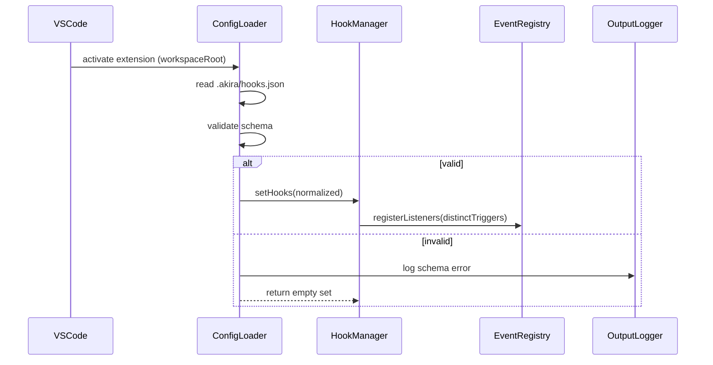
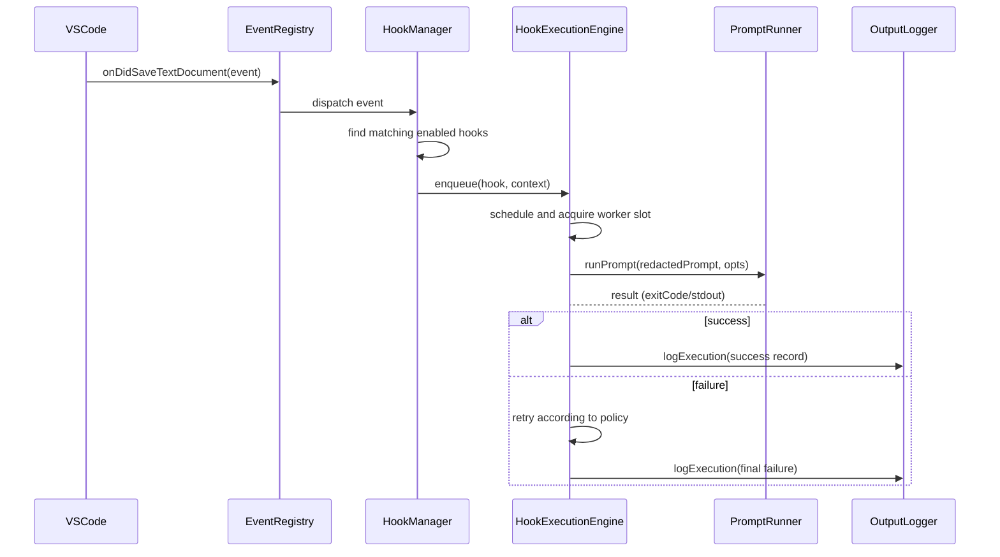
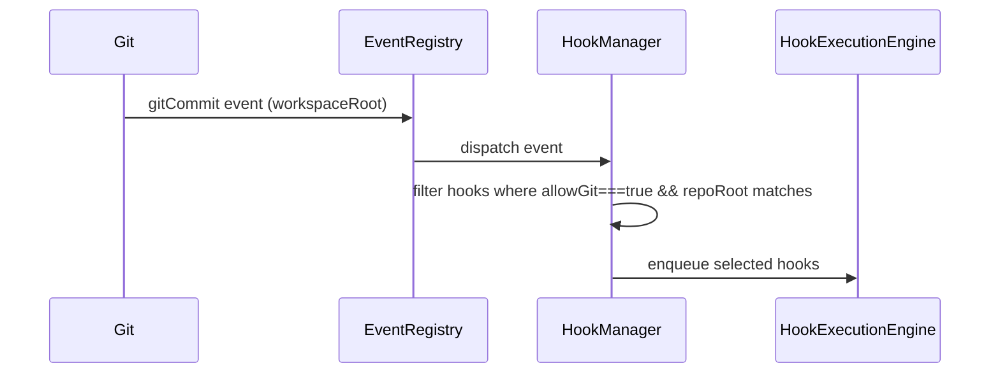
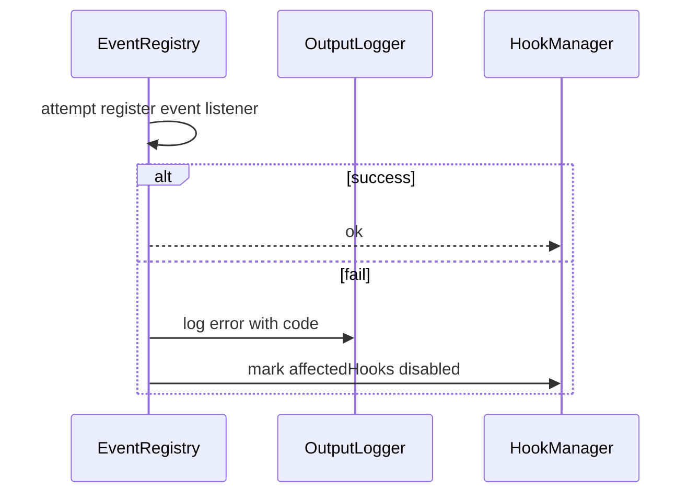

# Design Document

## Overview

Implement an agent hooks subsystem as a VS Code extension module that loads workspace-level hook declarations (.akira/hooks.json), registers VS Code event listeners, and runs prompts in the background via a concurrent, cancelable, retryable execution engine. Design goals: safety (secrets redaction, git safeguards), low-latency registration/loading, non-blocking background execution, observability (output channel logs + structured execution records), and testability.

## System Architecture

Major components

- Config Loader
  - Loads and validates `.akira/hooks.json` within workspace root.
  - Emits normalized in-memory Hook objects.
- Event Registry
  - Maps VS Code event types to registered callbacks.
  - Ensures no duplicate registration per workspace.
- Hook Manager
  - Holds normalized hook state, enabled flag, concurrency settings.
  - Coordinates registration/unregistration and responds to config changes.
- Hook Execution Engine
  - Scheduler + worker pool that enqueues and executes Hook runs.
  - Implements concurrency limits, timeouts, retries, redaction, logging.
- Prompt Runner
  - Responsible for sending prompt payloads to agent/local runner and returning results.
- Output Logger
  - Dedicated VS Code OutputChannel and structured JSON logs to disk optional.
- Secrets Redactor
  - Pre-processes prompts and logs, replacing patterns with "[REDACTED]".
- Telemetry & Metrics (optional)
  - Tracks counts, latencies, error rates for monitoring.

Component interactions

- Activation → Config Loader reads file → Hook Manager stores hooks → Event Registry registers listeners for distinct triggers → On event: Event Registry forwards to Hook Manager → Hook Manager enqueues matching hooks → Hook Execution Engine runs Prompt Runner → Logger & Redactor record outcomes.

Data flow

1. File read (.akira/hooks.json) → validate → normalized Hook objects.
2. Trigger event → matching Hook IDs evaluated → HookExecutionRecords enqueued.
3. Execution → prompt payload redacted → Prompt Runner executes → results/timeouts/errors → log + retry if needed.

## Component Design

### Config Loader

Purpose: load and validate hooks config quickly and provide normalized objects.

Public API

- async loadHooks(workspaceRoot: Uri): Promise<Hook[]>
- onDidChange: Event<HookLoadResult> (success/failure)

Internal

- File watcher for `.akira/hooks.json`
- JSON Schema validator (ajv)
- Normalizer (set defaults: concurrency=4, enabled=true, timeout, retry)

Dependencies: VS Code workspace FS, AJV validator, Output Logger.

Behavior notes

- Must complete initial load within 2000 ms (fail to log schema error).
- On validation error: emit schema error to output channel and return empty set.

### Event Registry

Purpose: register and manage VS Code event listeners for trigger types.

Public API

- registerListeners(triggers: TriggerType[], workspaceRoot: Uri): Promise<void>
- unregisterListeners(workspaceRoot: Uri): void
- isRegistered(trigger: TriggerType, workspaceRoot: Uri): boolean

Internal

- Map<workspaceRoot, Map<trigger, Disposable>>
- Dedup logic to prevent duplicate callbacks

Dependencies: VS Code API, Output Logger

Failure handling

- On registration failure: log error with error code and mark affected hooks disabled in Hook Manager.

### Hook Manager

Purpose: authoritative in-memory store of hooks + lifecycle operations.

Public API

- setHooks(workspaceRoot: Uri, hooks: Hook[]): void
- getEnabledHooksForEvent(event: HookEvent): Hook[]
- disableHook(hookId: string, reason?: string): void
- enableHook(hookId: string): void

Internal

- Map<workspaceRoot, Map<hookId, HookRuntime>>
- Normalization: ensure hookId unique, fill defaults

Dependencies: Config Loader, Event Registry, Hook Execution Engine, Logger

### Hook Execution Engine

Purpose: schedule/enqueue and execute hooks with concurrency, timeouts, retries, and redaction.

Public API

- enqueue(hook: Hook, context: HookTriggerContext): Promise<ExecutionId>
- shutdown(): Promise<void>

Internal structure

- Global/Workspace worker pools (Semaphore-based) honoring hook.concurrency (default 4)
- Execution lifecycle per-run:
  - create ExecutionRecord with start timestamp
  - redaction of prompt & logs
  - spawn Prompt Runner and begin timer
  - enforce timeout → cancel/abort runner
  - on non-zero/error → apply retry policy with backoff
  - persist ExecutionRecord log to OutputChannel
- Retry policy: count, backoff (linear/exponential), jitter
- Timeout: cancelation via AbortController

Dependencies: Prompt Runner, Secrets Redactor, Logger

### Prompt Runner

Purpose: invoke agent/local runner with prompt payload.

Public API

- runPrompt(prompt: string, opts: PromptOptions): Promise<PromptResult>

Behavior

- Receives an AbortSignal for cancellation
- Returns result object with exitCode, stdout/stderr, duration
- Runs off main thread (child process / worker) to avoid UI blocking

Dependencies: Node child_process or agent API client, Hook Execution Engine

### Output Logger

Purpose: single source for textual and structured logging.

Public API

- logInfo(ctx, message)
- logError(ctx, error)
- logExecution(record: ExecutionRecord)
- show() // bring output pane forward

Behavior

- Always redact via Secrets Redactor before output
- Structured logs as JSON lines optionally written to workspace `.akira/logs/hooks.log`

Dependencies: VS Code OutputChannel, Secrets Redactor

### Secrets Redactor

Purpose: replace configured secret patterns with "[REDACTED]".

Public API

- redact(text: string, patterns: RegExp[]): string

Notes

- Patterns come from hooks.json or global config
- Applied to prompts and logs before logging

## Data Model

Key types (TypeScript-like)

```typescript
// typescript
type TriggerType =
  | "onDidSaveTextDocument"
  | "onWillSaveTextDocument"
  | "gitCommit"
  | string;

interface Hook {
  id: string; // hook ID
  trigger: TriggerType;
  pattern?: string; // optional scope selector for files
  prompt: string;
  enabled?: boolean; // default true
  concurrency?: number; // default 4
  timeoutMs?: number; // in ms
  retry?: { count: number; backoffMs?: number; backoffFactor?: number };
  allowGit?: boolean; // default false
  repoRoot?: string; // required for git triggers
  secretPatterns?: string[]; // regex strings
  metadata?: Record<string, any>;
}

interface HookRuntime {
  hook: Hook;
  disabledReason?: string;
  activeExecutions: Set<ExecutionId>;
}

interface ExecutionRecord {
  id: string;
  hookId: string;
  startTs: string;
  endTs?: string;
  status: "queued" | "running" | "success" | "failed" | "timeout" | "canceled";
  exitCode?: number;
  attempts: number;
  logs?: string;
}
```

Schema (JSON Schema excerpt)

```json
{
  "$schema": "http://json-schema.org/draft-07/schema#",
  "type": "object",
  "properties": {
    "hooks": {
      "type": "array",
      "items": {
        "type": "object",
        "required": ["id", "trigger", "prompt"],
        "properties": {
          "id": { "type": "string" },
          "trigger": { "type": "string" },
          "prompt": { "type": "string" },
          "enabled": { "type": "boolean", "default": true },
          "concurrency": { "type": "integer", "minimum": 1, "default": 4 },
          "timeoutMs": { "type": "integer", "minimum": 1000, "default": 60000 },
          "retry": {
            "type": "object",
            "properties": {
              "count": { "type": "integer", "minimum": 0, "default": 0 },
              "backoffMs": { "type": "integer", "minimum": 0, "default": 1000 },
              "backoffFactor": { "type": "number", "minimum": 1, "default": 2 }
            }
          },
          "allowGit": { "type": "boolean", "default": false },
          "repoRoot": { "type": "string" },
          "secretPatterns": { "type": "array", "items": { "type": "string" } }
        }
      }
    }
  }
}
```

Storage mechanism

- Primary storage: workspace file `.akira/hooks.json`
- In-memory normalized map per workspace (non-persistent)
- Optional: append-only log file `.akira/logs/hooks.log` for structured run history

Validation rules

- Unique hook.id
- For git triggers: allowGit must be true and repoRoot must be present
- concurrency >=1
- timeoutMs reasonable (min 1000ms)
- secretPatterns must be valid regex

Data lifecycle

- Load on workspace open and on file change events
- On load validation failure → keep previous valid config or empty and log error
- Hook runtime state exists while workspace open and cleared on close or workspace change

## Sequence Diagrams (Mermaid)

Startup / config load



Event processing (file save)



Git commit security flow



Error handling (listener registration failure)



## Design Decisions

Technology choices

- TypeScript for extension code (VS Code extension standard).
- ajv JSON Schema validator for config validation.
- Node worker/child_process or agent HTTP client for prompt execution.
- Semaphore-based worker pool for concurrency.

Patterns used

- Producer-consumer (queue + workers)
- Watcher + event-driven registration
- Circuit-breaker-like disablement on registration failures
- Strategy pattern for retry/backoff

Trade-offs

- In-memory store vs DB: choose in-memory for simplicity and deterministic workspace-scoped behavior.
- Use child processes for prompt execution to avoid blocking VS Code; this uses more OS resources but isolates executions.
- Default concurrency of 4 balances throughput and resource usage; per-hook concurrency supported.

Alternatives considered and rejected

- Running prompts synchronously on UI thread — rejected due to blocking.
- Persisting hook state to global extension storage — rejected to keep hooks reproduceable per workspace.

## Error Handling Strategy

Error categories

- Config validation errors (schema errors)
- Listener registration errors
- Execution errors (non-zero exit / exceptions)
- Timeout cancellations
- Prompt runner internal errors

Recovery mechanisms

- Validation error: log, keep previous config if available.
- Listener registration failure: log with code, disable affected hooks until manual re-enable or fix.
- Execution failure: retry per policy; on final failure log structured failure.
- Timeout: abort prompt runner via AbortSignal and log start/end timestamps.

User feedback

- All important errors/emissions written to dedicated OutputChannel with redaction applied.
- Schema errors are clearly labeled and include file path and validation messages.
- Optionally pop up info/warning message when critical failures occur (config missing, listeners fail).

Logging & debugging

- Structured JSON lines for execution events (timestamp, hookId, status, attempts).
- Human-friendly summary lines in OutputChannel.
- Debug logs gated behind extension debug flag.

## Performance Considerations

Expected characteristics

- Config load: targeted ≤ 2000 ms for initial load; use async FS + schema validation off main UI thread.
- Listener registration: targeted ≤ 500 ms on activation (register only distinct triggers).
- Event-to-enqueue latency: targeted ≤ 1000 ms.

Scalability limits

- Execution concurrency bounded per-hook and global worker pool. Default global per-hook concurrency is 4; large numbers of hooks or prompts can saturate CPU/memory.

Resource usage optimizations

- Use pooled worker processes or reuse long-lived child workers to avoid heavy spawn overhead for frequent small prompts.
- Throttle high-frequency triggers (debounce / coalesce) for same file within short window.
- Respect configured concurrency per-hook and global caps.

Performance monitoring

- Expose metrics: activeExecutions, queueLength, averageLatency via logs/telemetry.

## Security & Privacy

Authentication/authorization

- Not applicable for local workspace hooks; agent calls that require credentials must use user-managed tokens stored by users (not as plain text in prompts).

Data protection

- Secrets redaction: configurable secretPatterns; redactor replaces matches with "[REDACTED]" before logging or output.
- Avoid persisting raw prompt content containing secrets to logs; redact before writing to `.akira/logs` if enabled.
- For git triggers require allowGit=true and repoRoot presence to avoid accidental runs during commits.

Input validation

- Strict JSON Schema validation for `.akira/hooks.json`.
- Validate regex patterns at load and fail early on invalid patterns.

Other best practices

- Minimize prompt visibility in UI (runs in background).
- Provide an explicit allowlist for git-triggered hooks.

## Testing Strategy

Unit tests

- Config Loader: valid/invalid schema, defaulting behavior.
- Event Registry: no duplicate registration, proper deregistration.
- Hook Manager: filtering logic for triggers and git allowlist.
- Execution Engine: concurrency, timeout, retry logic using mocked Prompt Runner and simulated delays/errors.
- Secrets Redactor: pattern coverage and correctness.

Integration tests

- Use VS Code extension test runner (vscode-test) simulating workspace open, file save, git commit events.
- Use a local fake Prompt Runner to validate end-to-end execution, retries, and log output.
- Simulate high-frequency triggers to test queuing/debounce behavior.

Mocks/stubs

- Mock VS Code events and workspace FS.
- Stub Prompt Runner to return configurable success/failure/timeouts.
- Capture OutputChannel content for assertions.

Testability considerations

- Components communicate via well-defined interfaces to allow dependency injection for tests.

## Future Extensibility

Extension points

- Plugin/adapters for additional trigger types (custom language server events, external webhooks).
- Pluggable PromptRunner implementations (HTTP agent client, local ML runtime, remote runner).
- Customizable redaction strategies and global secret store integration.

Backward compatibility

- Schema versioning for `.akira/hooks.json` with "schemaVersion" field to allow migration paths.
- Defaults ensure older configs still function with sensible values.

Planned enhancements

- UI for viewing hook status and execution history.
- Per-workspace policy UI to approve/disable hooks on sensitive events.
- Rate-limiting controls, persistent execution history, searchable logs.

---

Appendix: Example TypeScript interfaces (summary)

```typescript
// typescript
interface HookTriggerContext {
  workspaceRoot: string;
  filePath?: string;
  eventType: TriggerType;
  metadata?: Record<string, any>;
}

interface ExecutionResult {
  exitCode: number | null;
  stdout?: string;
  stderr?: string;
}
```

This design maps directly to the requirements: config load/validation/normalized in-memory model (REQ-1), registration dedupe and error handling (REQ-2), background non-blocking concurrent execution with timeout/retry (REQ-3), and git + secret redaction constraints (REQ-4).
