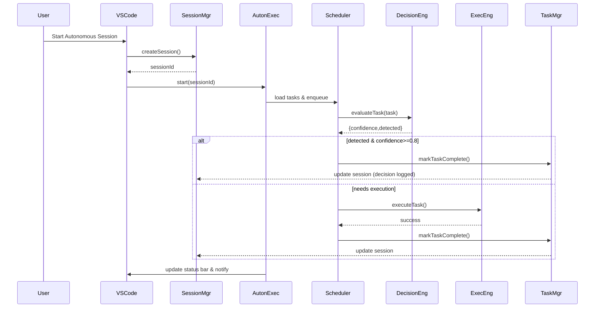
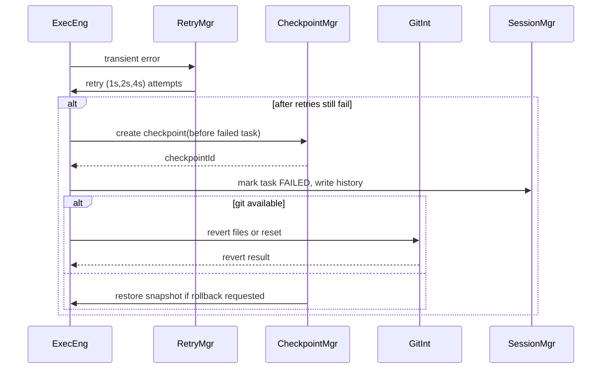
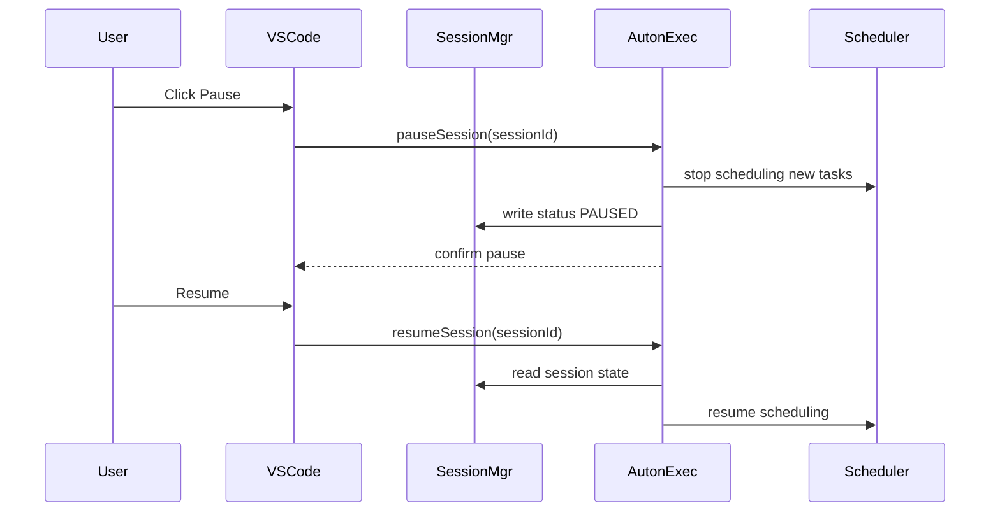

# Design Document

## Overview

Implement an event-driven, background-capable autonomous executor inside a VS Code extension (primary file: `autonomous-executor.ts`). The design emphasizes safe, auditable, resumable autonomous sessions via checkpointed markdown state, policy-driven limits, contextual decisioning (LLM-assisted confidence scoring), automatic retries/rollback, and integration with VS Code UI (status bar, notifications, output channel) and Git when available.

## System Architecture

Major components and responsibilities

- Autonomous Executor (autonomous-executor.ts): orchestrates session lifecycle, task phases, scheduling, and high-level decision flow.
- Scheduler / Worker Pool: manages concurrency (configurable maxConcurrentTasks), queues tasks and dispatches workers.
- Task Manager: parses `tasks.md`, evaluates tasks (detection), marks progress (task checkbox updates).
- Decision Engine: evaluates task completeness using heuristics + LLM calls and produces confidence scores & reasoning.
- Execution Engine: executes actions (file ops, commands, LLM writes), coordinates retries and backoff.
- Checkpoint Manager: creates/restores markdown checkpoints under `.akira/checkpoints/<session-id>/`.
- Session Manager: creates session files in `.akira/sessions/<session-id>/session.md`, persists history, decisions, rollbacks, API logs.
- Policy Manager: enforces settings (`akira.autonomous.*`) and approval policies (destructive ops).
- Git Integrator: performs safe rollbacks via Git when available.
- Storage Layer: file I/O abstraction for session & checkpoint markdown, cleanup, retention.
- UI Controller: status bar item, notifications, quick picks, OutputChannel updates.
- API Logger: logs LLM/external API calls to `.akira/sessions/<session-id>/api-calls.md`.
- Event Bus / Observability: central async event stream for events (taskStart, taskComplete, error, checkpointCreated).

Component interactions and dependencies

- User -> Command Palette triggers Session Manager -> Autonomous Executor.
- Autonomous Executor uses Scheduler -> Worker Pool -> Execution Engine.
- Decision Engine invoked prior to Execution Engine for task detection.
- Execution Engine and Task Manager update Session Manager / Checkpoint Manager and Storage Layer.
- Policy Manager consulted before destructive operations.
- UI Controller subscribes to Event Bus for status bar & notifications.

Data flow

1. Parse `tasks.md` -> Task objects.
2. Start session -> create session file.
3. For each task: Decision Engine => confidence -> either mark complete or send to Scheduler for execution.
4. Execution Engine does file ops / LLM calls; API Logger records calls.
5. On success -> Task Manager updates tasks.md, Session Manager updates session file, Checkpoint Manager may create phase checkpoint.
6. On failure -> RetryManager attempts retries; final failure -> Checkpoint created; Rollback via Git/Checkpoint if configured; Session Manager logs rollback.

## Component Design

Autonomous Executor

- Purpose: top-level session orchestration, lifecycle (start/pause/resume/stop), phase transitions.
- Public API:
  - startSession(sessionConfig): Promise<SessionId>
  - pauseSession(sessionId): Promise<void>
  - resumeSession(sessionId): Promise<void>
  - stopSession(sessionId): Promise<void>
- Internal:
  - maintains in-memory SessionContext with cursor to current phase/task
  - registers with Event Bus
  - calls Scheduler.startProcessing(sessionContext)
- Dependencies: Scheduler, Session Manager, UI Controller, Policy Manager

Scheduler / Worker Pool

- Purpose: concurrency control, queueing.
- Public API:
  - enqueueTask(task, sessionContext)
  - setConcurrency(n)
  - shutdown()
- Internal:
  - priority queue, semaphore-like concurrency limiter
  - worker functions call Execution Engine
- Dependencies: Execution Engine, Policy Manager

Task Manager

- Purpose: parse `tasks.md`, map tasks to success criteria, update checkboxes and timestamps.
- Public API:
  - loadTasks(workspaceRoot): Promise<Task[]>
  - markTaskComplete(taskId, timestamp)
  - markTaskFailed(taskId, details)
  - persistTasks()
- Internal:
  - AST/regex-based parsing of markdown; stores line indices for in-place updates
- Dependencies: Storage Layer, Session Manager

Decision Engine

- Purpose: determine need-to-execute via local heuristics + optional LLM
- Public API:
  - evaluateTask(task, context): Promise<{confidence:number, reasoning:string, detected:boolean}>
- Internal:
  - quick checks: file existence, command result hooks, simple content diffs
  - optional LLM call with retry via Api Logger & Execution Engine
  - confidence scoring rules (weighted)
- Dependencies: Api Logger, Execution Engine (for command probes), Session Manager

Execution Engine

- Purpose: run the concrete actions (file writes, shell commands, LLM content generation)
- Public API:
  - executePlan(plan, sessionContext): Promise<ExecutionResult>
- Internal:
  - wraps file system ops, spawns terminals for commands, LLM calls via ApiClient
  - coordinates with Policy Manager for destructive ops
  - updates file modification counters
- Dependencies: Policy Manager, Git Integrator, Api Logger, Storage Layer

Checkpoint Manager

- Purpose: create/restore phase checkpoints stored as markdown with snapshots
- Public API:
  - createCheckpoint(sessionId, phaseId, metadata, snapshot): Promise<CheckpointId>
  - restoreCheckpoint(checkpointId): Promise<RestoreResult>
  - compactCheckpoints(sessionId)
- Internal:
  - snapshot format: markdown file with YAML front-matter + payload (file diffs or base64 archives)
- Dependencies: Storage Layer, Git Integrator

Session Manager

- Purpose: manage session.md, decisions.md, history.md, rollbacks.md, api-calls.md
- Public API:
  - createSession(sessionMeta): Promise<SessionId>
  - updateSession(sessionId, patch): Promise<void>
  - readSession(sessionId): Promise<SessionState>
- Internal:
  - ensures write operations complete within required timings (1–2s) using batched writes
- Dependencies: Storage Layer, UI Controller, Event Bus

Policy Manager

- Purpose: validate settings and enforce runtime policies (limits & approvals)
- Public API:
  - validateSettings(settings): void | throws
  - checkDestructiveOp(sessionId, opDetails): Promise<ApprovalResult>
  - consumeFileModification(count): boolean
- Internal:
  - tracks counters per session and triggers PAUSED_FOR_APPROVAL
- Dependencies: VS Code Configuration API, UI Controller

Git Integrator

- Purpose: leverage Git for rollbacks; fallback to checkpoint snapshots
- Public API:
  - canRollbackWithGit(): Promise<boolean>
  - createRollbackPatch(files): Promise<void>
  - revertToCommit(commitHash): Promise<void>
- Internal:
  - uses `git` CLI via child process; fallbacks if not available
- Dependencies: Execution Engine

UI Controller

- Purpose: status bar, notifications, quick pick actions, output channel
- Public API:
  - showStatus(sessionId, label)
  - updateStatus(sessionId, details)
  - showNotification(type,msg,actions?)
- Internal:
  - status bar item with click handler opening quick pick menu: View Session Log, Pause, Resume, Stop
- Dependencies: VS Code Extension API, Session Manager

API Logger

- Purpose: log external API/LLM call details and retries
- Public API:
  - logApiCall(sessionId, callMeta)
  - logApiFailure(sessionId, callMeta, error)
- Internal:
  - write to `.akira/sessions/<session-id>/api-calls.md`

Storage Layer

- Purpose: atomic file reads/writes, markdown creation, retention cleanup
- Public API:
  - writeFileAtomic(path, content)
  - readFile(path)
  - ensureDir(path)
  - cleanupOldCheckpoints(retentionDays)
- Internal:
  - back-pressure management for write bursts; queue and flush

Event Bus

- Purpose: internal pub/sub for telemetry and UI
- Events: sessionStarted, taskEvaluated, taskQueued, taskStarted, taskComplete, taskFailed, checkpointCreated, rollbackPerformed, sessionPaused, sessionResumed

## Data Model

Key data types & interfaces (TypeScript-like)

- SessionState
  - id: string
  - workspaceRoot: string
  - status: "RUNNING"|"PAUSED"|"PAUSED_FOR_APPROVAL"|"FAILED"|"COMPLETED"|"STALE"
  - tasks: TaskRecord[]
  - currentPhase: number
  - createdAt, updatedAt: ISO8601
- TaskRecord
  - id: string
  - title: string
  - rawLine: number
  - checkboxState: "PENDING"|"COMPLETE"|"FAILED"
  - completionTimestamp?: ISO8601
  - successCriteria?: SuccessCriteria
  - lastDecision?: {confidence:number,reason:string,timestamp:ISO}
  - retryCount: number
- Checkpoint (markdown)
  - YAML front-matter:
    - checkpointId, sessionId, phase, createdAt, files:[{path,hash,base64?}], gitCommit?
  - body: human-readable snapshot
- DecisionRecord (decisions.md entries)
  - timestamp, taskId, confidence, reasoning, provider (heuristic|LLM)
- ApiCallRecord
  - timestamp, model, endpoint, promptLen, tokens, latency, statusCode, attempt

Storage formats

- session.md: YAML front-matter plus table of tasks and status
- decisions.md, rollbacks.md, history.md, api-calls.md: append-only markdown entries
- tasks.md: source of truth with checkboxes updated in-place

Data validation rules

- session IDs are UUID v4
- timestamps are ISO 8601 UTC
- numeric settings validated: maxConcurrentTasks ∈ [1,10], maxTasksPerSession ≥1, maxFileModifications ≥0
- checkpoint retention days ∈ [1,3650]

Storage mechanisms & lifecycle

- Files under workspace:
  - .akira/sessions/<session-id>/{session.md,decisions.md,history.md,rollbacks.md,api-calls.md}
  - .akira/checkpoints/<session-id>/phase-<N>.md
- In-memory caches for active sessions; persisted state written atomically on each important event and batched for throughput
- Cleanup: background retention job uses `checkpointRetention` setting to delete old checkpoints and log to OutputChannel

## Sequence Diagrams (Mermaid)

User starts session and normal task flow:

Failure, retries, checkpoint, rollback:

Pause/Resume flow:

## Design Decisions

Technology choices & rationale

- TypeScript + VS Code Extension API: native for VS Code integrations and good dev ergonomics.
- Markdown session/checkpoint files: human-readable, easy versioning via Git.
- Event-driven (Event Bus) + Worker Pool: concurrency control while keeping UI responsive.
- Use of Git for rollbacks when present for safety and fidelity.

Patterns used

- Command pattern for actions (execute/rollback).
- Producer-consumer (Scheduler/Worker Pool).
- Strategy pattern for decision providers (heuristic vs LLM).
- Circuit breaker for external API failures (pause on auth errors).

Trade-offs

- Filesystem-based persistence (markdown) simplifies auditing and user inspection but is slower than DB; mitigated via batched writes and in-memory caching.
- LLM decisioning adds nondeterminism; mitigated by confidence thresholds and logging.

Alternative approaches rejected

- Storing session state in an external DB — rejected for complexity and offline-first goals.
- Fully synchronous execution blocking UI — rejected to meet non-blocking requirements.

## Error Handling Strategy

Error types & categories

- Transient failures: network timeouts, rate limits, temporary file locks.
- Permanent failures: syntax error in task, authentication errors.
- Policy violations: destructive op without approval.

Recovery mechanisms

- Retries with exponential backoff for transient errors (1s, 2s, 4s).
- On persistent failure: create checkpoint capturing pre-failure state, mark task as Failed, log details, optionally rollback.
- If Git available: prefer Git revert; otherwise apply stored snapshot diffs.
- On LLM auth errors: pause session, notify user, log failure.

User feedback

- Notifications for task completion, milestones, failures, approvals required.
- Status bar shows running session and clickable quick picks to view logs and control session.
- OutputChannel logs for debug (structured JSON + human readable).

Logging & debugging support

- Append-only markdown logs per session for decisions, history, rollbacks, API calls.
- Output channel with verbose level for extension developers; correlation IDs for requests.

## Performance Considerations

Scalability limits

- Concurrency capped by `maxConcurrentTasks` default 3 (configurable 1–10).
- In-memory session contexts for active sessions only; multiple sessions supported but each consumes memory proportional to active tasks & file snapshots.

Resource usage

- File snapshots can be large; checkpoints store diffs or file hashes + archived content (base64) only for changed files.
- API/Large LLM requests tracked; rate limiting is applied.

Optimization strategies

- Batched atomic writes to session files with debounce (100–500ms) but guarantee 2s acceptance criteria for updates on task completion.
- Checkpoint compaction policy: keep phase boundary checkpoints and N most recent to limit disk usage.
- Lazy-load historical files when viewing logs.

Performance monitoring

- Metrics in OutputChannel: queue length, average task latency, API call latencies, checkpoint sizes.
- Expose basic telemetry events (opt-in) for core metrics.

## Security & Privacy

Authentication & Authorization

- Extension defers to user-managed API keys (LLM), does not transmit credentials externally.
- On API auth failures (401/403) session paused and user notified.

Data protection

- Session & checkpoint files stored in workspace `.akira/` (user-visible); sensitive content flagged in logs and optionally redacted by configuration.
- Recommend .gitignore update automation to avoid committing ephemeral API keys; extension warns on secrets in tasks.

Input validation

- Validate settings ranges; sanitize task parsing to prevent code injection into shell command execution (shell escapes, use child_process with array args).
- Confirm destructive operations via policy manager when enabled.

Security best practices

- Use least-privilege: files operations limited to workspace.
- Avoid storing raw API keys in session files.
- Provide user controls for automatic uploads / telemetry.

## Testing Strategy

Unit testing

- Component-level tests for Decision Engine, Checkpoint Manager, Policy Manager, Scheduler.
- Mocks for file system, Git CLI, LLM API (injectable ApiClient).
- Use Jest + ts-jest for isolation.

Integration testing

- End-to-end tests using VS Code Extension Test Runner (vscode-test) with a temporary workspace: simulate tasks.md, start session, assert session files, checkpoints, status bar updates.
- Simulate Git repo vs no-Git scenarios.

Testability considerations

- Dependency injection for all external services (file system, Git, API).
- Deterministic clocks (injectable clock) for timestamps in tests.
- Expose hooks on Event Bus for deterministic sequencing.

Mock/stub strategies

- LLM API stub to return predetermined confidence scores and content.
- File system virtual FS using memfs for unit/integration tests.
- Git stub to simulate commit/revert behaviors.

## Future Extensibility

Extension points

- Decision Providers: add plugins for domain-specific detectors.
- Execution Providers: add other runners (Docker containers, remote executors).
- Storage adapters: swap markdown files for remote store.

Plugin architecture

- Expose a registry for DecisionProvider and ExecutionProvider interfaces that third-parties can register via extension API.

Backward compatibility

- Version session file front-matter; migration scripts to upgrade older session/checkpoint formats.
- Graceful fallback when new fields missing.

---

This design maps feature requirements to concrete components, APIs, file formats, and runtime behaviors, meeting constraints such as concurrency, time bounds for file writes/notifications, confidence-based decisioning, retries/rollback, and user-facing controls (status bar, quick pick, notifications).
