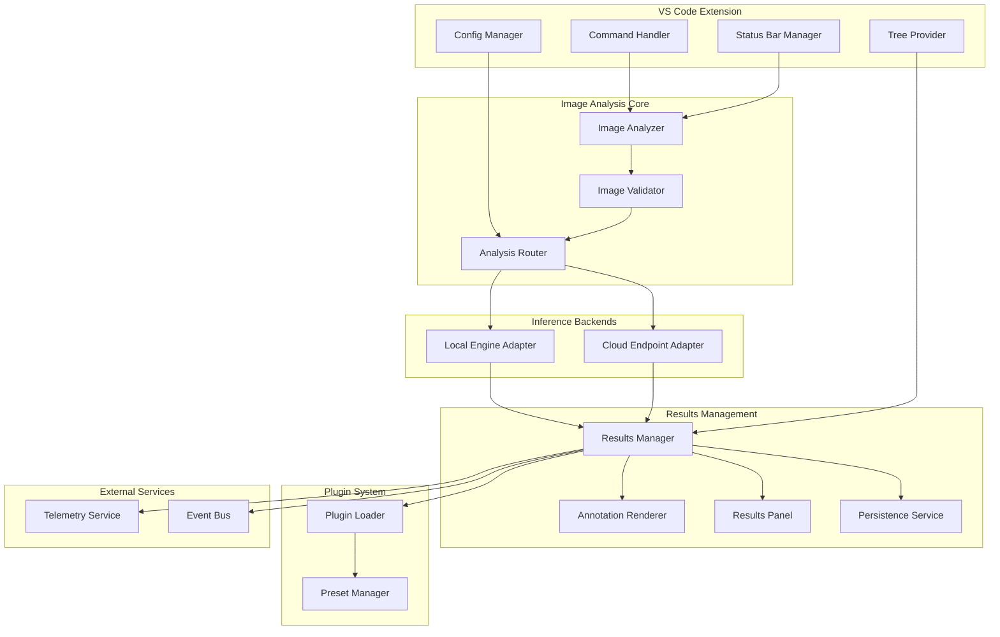
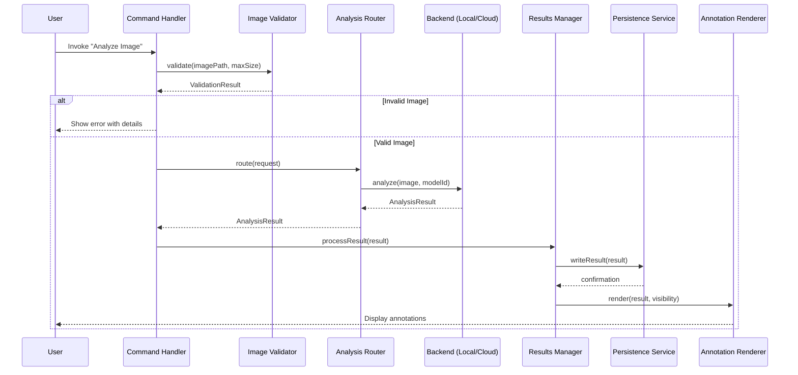
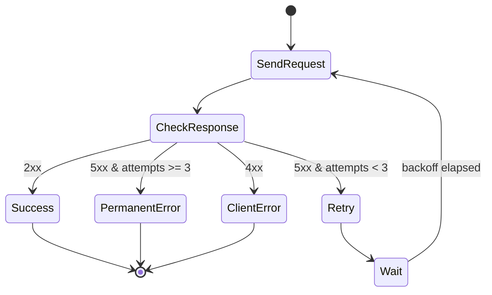
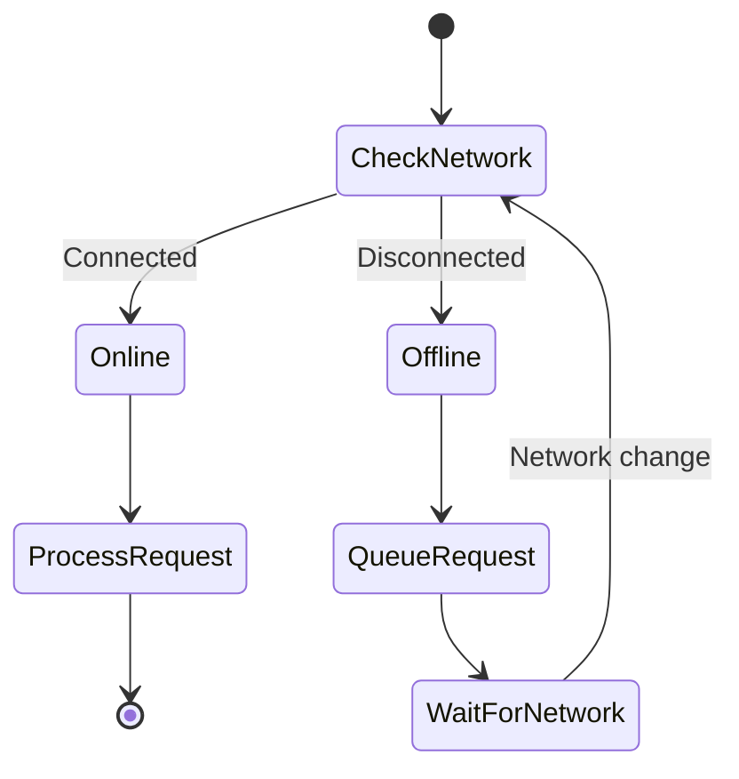

# Design Document: Multimodal Input Support

## Overview

This design document specifies the architecture and implementation for multimodal input support enabling image analysis and understanding within VS Code. The system integrates with VS Code's extension API to allow developers to submit images for automated analysis, view results as inline annotations, configure inference backends (local or cloud), and persist analysis history within the workspace.

The design follows the existing Akira extension patterns, leveraging TypeScript, VS Code Extension API, and established architectural patterns from the agent-hooks system for event handling and execution management.

## Architecture



### Component Responsibilities

1. **Image Analyzer**: Orchestrates the analysis workflow, coordinates validation, routing, and result handling
2. **Image Validator**: Validates image format, size, and MIME type before processing
3. **Analysis Router**: Routes analysis requests to appropriate backend based on configuration
4. **Local Engine Adapter**: Interfaces with local analysis binary via CLI
5. **Cloud Endpoint Adapter**: Handles HTTPS communication with cloud inference endpoints
6. **Results Manager**: Manages analysis results lifecycle, triggers annotations and persistence
7. **Annotation Renderer**: Renders inline annotations in VS Code editor overlays
8. **Results Panel**: Provides structured JSON view of analysis results
9. **Persistence Service**: Handles workspace storage with encryption and rotation
10. **Plugin Loader**: Loads and executes workspace plugins
11. **Preset Manager**: Manages model presets and configurations
12. **Telemetry Service**: Emits anonymized telemetry events
13. **Event Bus**: Publishes workspace events for external consumers

## Components and Interfaces

### Core Types

```typescript
/**
 * Supported image MIME types
 */
type SupportedMimeType =
  | "image/png"
  | "image/jpeg"
  | "image/webp"
  | "image/gif";

/**
 * Inference mode selection
 */
type InferenceMode = "local" | "cloud";

/**
 * Analysis request input
 */
interface AnalysisRequest {
  imagePath: string;
  mimeType: SupportedMimeType;
  fileSize: number;
  modelId: string;
  confidenceThreshold: number;
  inferenceMode: InferenceMode;
  workspaceRoot: string;
}

/**
 * Bounding box coordinates for detected objects
 */
interface BoundingBox {
  x: number;
  y: number;
  width: number;
  height: number;
}

/**
 * Individual detection label with confidence
 */
interface DetectionLabel {
  label: string;
  confidence: number;
  boundingBox?: BoundingBox;
}

/**
 * Complete analysis result
 */
interface AnalysisResult {
  id: string;
  imagePath: string;
  timestamp: string;
  modelId: string;
  inferenceMode: InferenceMode;
  duration: number;
  labels: DetectionLabel[];
  ocrText?: string;
  rawResponse?: unknown;
}

/**
 * Persisted result entry in results.json
 */
interface PersistedResult {
  imagePath: string;
  timestamp: string;
  resultsSummary: {
    labelCount: number;
    topLabels: string[];
    hasOcrText: boolean;
  };
  modelId: string;
  fullResult: AnalysisResult;
}

/**
 * Results file structure
 */
interface ResultsFile {
  version: string;
  results: PersistedResult[];
}
```

### Image Validator Interface

```typescript
interface ImageValidationResult {
  valid: boolean;
  mimeType?: SupportedMimeType;
  fileSize?: number;
  error?: {
    code: "INVALID_MIME_TYPE" | "FILE_TOO_LARGE" | "FILE_NOT_FOUND";
    message: string;
    detectedMimeType?: string;
    acceptedMimeTypes?: SupportedMimeType[];
    maxSizeBytes?: number;
    actualSizeBytes?: number;
  };
}

interface IImageValidator {
  /**
   * Validate an image file for analysis
   * @param imagePath - Path to the image file
   * @param maxSizeMB - Maximum allowed file size in megabytes
   * @returns Validation result with MIME type and size if valid
   */
  validate(
    imagePath: string,
    maxSizeMB: number,
  ): Promise<ImageValidationResult>;
}
```

### Analysis Router Interface

```typescript
interface IAnalysisRouter {
  /**
   * Route analysis request to appropriate backend
   * @param request - Analysis request with configuration
   * @returns Analysis result from selected backend
   */
  route(request: AnalysisRequest): Promise<AnalysisResult>;

  /**
   * Check if the configured backend is available
   * @param mode - Inference mode to check
   * @returns True if backend is available
   */
  isBackendAvailable(mode: InferenceMode): Promise<boolean>;
}
```

### Local Engine Adapter Interface

```typescript
interface LocalEngineConfig {
  binaryPath: string;
  timeout: number;
}

interface ILocalEngineAdapter {
  /**
   * Execute local analysis binary
   * @param imagePath - Path to image file
   * @param modelId - Model identifier
   * @returns Analysis result from local engine
   */
  analyze(imagePath: string, modelId: string): Promise<AnalysisResult>;

  /**
   * Check if local engine binary is available
   * @returns True if binary exists and is executable
   */
  isAvailable(): Promise<boolean>;
}
```

### Cloud Endpoint Adapter Interface

```typescript
interface CloudEndpointConfig {
  endpointUrl: string;
  timeout: number;
  retryConfig: {
    maxAttempts: number;
    backoffMs: number[];
  };
}

interface ICloudEndpointAdapter {
  /**
   * Send image to cloud inference endpoint
   * @param imageData - Base64 encoded image data
   * @param modelId - Model identifier
   * @returns Analysis result from cloud endpoint
   */
  analyze(imageData: string, modelId: string): Promise<AnalysisResult>;

  /**
   * Check endpoint health
   * @returns True if endpoint is reachable
   */
  isAvailable(): Promise<boolean>;
}
```

### Results Manager Interface

```typescript
interface IResultsManager {
  /**
   * Process and store analysis result
   * @param result - Analysis result to process
   * @returns Processed result with persistence confirmation
   */
  processResult(result: AnalysisResult): Promise<PersistedResult>;

  /**
   * Get analysis history for workspace
   * @param workspaceRoot - Workspace root path
   * @returns Array of persisted results
   */
  getHistory(workspaceRoot: string): Promise<PersistedResult[]>;

  /**
   * Clear analysis history
   * @param workspaceRoot - Workspace root path
   */
  clearHistory(workspaceRoot: string): Promise<void>;
}
```

### Persistence Service Interface

```typescript
interface PersistenceConfig {
  maxFileSizeMB: number;
  encryptionEnabled: boolean;
  encryptionKey?: string;
}

interface IPersistenceService {
  /**
   * Write result to storage
   * @param workspaceRoot - Workspace root path
   * @param result - Result to persist
   */
  writeResult(workspaceRoot: string, result: PersistedResult): Promise<void>;

  /**
   * Read all results from storage
   * @param workspaceRoot - Workspace root path
   * @returns Results file contents
   */
  readResults(workspaceRoot: string): Promise<ResultsFile>;

  /**
   * Rotate results file if size exceeded
   * @param workspaceRoot - Workspace root path
   * @returns True if rotation occurred
   */
  rotateIfNeeded(workspaceRoot: string): Promise<boolean>;
}
```

### Annotation Renderer Interface

```typescript
interface AnnotationVisibility {
  labels: boolean;
  ocrText: boolean;
  boundingBoxes: boolean;
}

interface IAnnotationRenderer {
  /**
   * Render annotations for analysis result
   * @param result - Analysis result to render
   * @param visibility - Visibility settings for annotation types
   */
  render(result: AnalysisResult, visibility: AnnotationVisibility): void;

  /**
   * Update visibility settings
   * @param visibility - New visibility settings
   */
  updateVisibility(visibility: AnnotationVisibility): void;

  /**
   * Clear all annotations
   */
  clear(): void;
}
```

### Plugin System Interface

```typescript
interface ImageAnalysisPlugin {
  id: string;
  name: string;
  version: string;
  processImage(
    imagePath: string,
    results: AnalysisResult,
  ): Promise<AnalysisResult>;
}

interface ModelPreset {
  id: string;
  name: string;
  modelId: string;
  confidenceThreshold: number;
  plugins: string[];
}

interface IPluginLoader {
  /**
   * Load plugins from workspace directory
   * @param workspaceRoot - Workspace root path
   * @returns Loaded plugins
   */
  loadPlugins(workspaceRoot: string): Promise<ImageAnalysisPlugin[]>;

  /**
   * Execute plugins on analysis result
   * @param result - Analysis result to process
   * @param pluginIds - Plugin IDs to execute in order
   * @returns Processed result
   */
  executePlugins(
    result: AnalysisResult,
    pluginIds: string[],
  ): Promise<AnalysisResult>;
}

interface IPresetManager {
  /**
   * Get available presets
   * @returns Array of model presets
   */
  getPresets(): ModelPreset[];

  /**
   * Apply preset to analysis request
   * @param presetId - Preset identifier
   * @param request - Base analysis request
   * @returns Request with preset applied
   */
  applyPreset(presetId: string, request: AnalysisRequest): AnalysisRequest;

  /**
   * Save current settings as preset
   * @param preset - Preset to save
   */
  savePreset(preset: ModelPreset): Promise<void>;
}
```

### Configuration Schema

```typescript
interface MultimodalInputConfig {
  // Inference settings
  inferenceMode: InferenceMode;
  cloudEndpointUrl: string;
  localEnginePath: string;

  // Analysis parameters
  modelId: string;
  maxImageSizeMB: number;
  confidenceThreshold: number;

  // Privacy settings
  localOnlyMode: boolean;
  encryptAnalysisStorage: boolean;
  userConsentGiven: boolean;

  // Telemetry
  telemetryEnabled: boolean;
  telemetryEndpoint: string;

  // Concurrency
  maxConcurrentAnalyses: number;
  queueLimit: number;
}
```

## Data Models

### Analysis Request Flow



### Retry Logic for Cloud Endpoint



### Results File Rotation

```mermaid
flowchart TD
    A[Write Result] --> B{File Size > 50MB?}
    B -->|No| C[Append to results.json]
    B -->|Yes| D[Rename to results-{timestamp}.json]
    D --> E[Create new results.json]
    E --> C
```

### Offline Queue Management



## Correctness Properties

_A property is a characteristic or behavior that should hold true across all valid executions of a system-essentially, a formal statement about what the system should do. Properties serve as the bridge between human-readable specifications and machine-verifiable correctness guarantees._

### Property 1: MIME Type Validation

_For any_ image file input, the Image Validator SHALL accept the file if and only if its MIME type is one of image/png, image/jpeg, image/webp, or image/gif.

**Validates: Requirements REQ-1.1**

### Property 2: File Size Validation

_For any_ image file with size greater than 25 megabytes, the Image Validator SHALL reject the file and return an error containing the size limit.

**Validates: Requirements REQ-1.4**

### Property 3: Analysis Initiation Latency

_For any_ valid image file, when the "Analyze Image" command is invoked, the system SHALL begin analysis (emit start event) within 500 milliseconds.

**Validates: Requirements REQ-1.2**

### Property 4: Progress Update Frequency

_For any_ analysis execution lasting longer than 500 milliseconds, the system SHALL emit progress updates at intervals no greater than 500 milliseconds.

**Validates: Requirements REQ-1.3**

### Property 5: Annotation Content Completeness

_For any_ analysis result with detection labels, the rendered annotation SHALL include the label text, confidence percentage, and bounding box coordinates for each detection.

**Validates: Requirements REQ-2.1**

### Property 6: Results JSON Serialization Round-Trip

_For any_ valid AnalysisResult object, serializing to JSON and deserializing back SHALL produce an equivalent object containing labels, confidences, OCR text, and timestamps.

**Validates: Requirements REQ-2.2**

### Property 7: Annotation Visibility Independence

_For any_ combination of visibility settings (labels, OCR text, bounding boxes), toggling one visibility setting SHALL not affect the visibility state of the other annotation types.

**Validates: Requirements REQ-2.3**

### Property 8: Analysis Routing by Mode

_For any_ analysis request, the Analysis Router SHALL route to the cloud endpoint when inferenceMode is "cloud" and to the local engine when inferenceMode is "local".

**Validates: Requirements REQ-3.1, REQ-3.2**

### Property 9: Cloud Endpoint Retry Behavior

_For any_ cloud endpoint request that receives HTTP 5xx responses, the system SHALL retry exactly 2 times with backoff delays of 1 second then 2 seconds before reporting a persistent error.

**Validates: Requirements REQ-3.3**

### Property 10: Settings Mode Persistence

_For any_ inference mode change in settings, the new mode SHALL be persisted and applied to all subsequent analysis requests until changed again.

**Validates: Requirements REQ-3.4**

### Property 11: Settings Validation Boundaries

_For any_ maximum image size setting value, the system SHALL reject values below 0.5 MB or above 100 MB with a validation error.

**Validates: Requirements REQ-4.2**

### Property 12: Analysis Blocking on Invalid Settings

_For any_ workspace with invalid settings values, the system SHALL prevent new analysis requests from being initiated until settings are corrected.

**Validates: Requirements REQ-4.3**

### Property 13: Persistence Format Completeness

_For any_ persisted result in results.json, the entry SHALL contain imagePath, timestamp, resultsSummary, and modelId fields.

**Validates: Requirements REQ-5.1**

### Property 14: Single Results File Per Workspace

_For any_ sequence of analysis results written to a workspace, all results SHALL be appended to a single results.json file (until rotation threshold).

**Validates: Requirements REQ-5.2**

### Property 15: Results File Rotation

_For any_ results.json file that exceeds 50 megabytes, the system SHALL rename it with a timestamp suffix and create a new results.json file before writing the next result.

**Validates: Requirements REQ-5.3**

### Property 16: Invalid Format Error Message Content

_For any_ image file with unsupported MIME type, the error message SHALL include the detected MIME type and the list of accepted MIME types.

**Validates: Requirements REQ-6.1**

### Property 17: Model Validation Error Propagation

_For any_ model validation error from the inference endpoint, the displayed error SHALL include the endpoint's error code and the model identifier from the request.

**Validates: Requirements REQ-6.2**

### Property 18: Offline Request Queuing

_For any_ cloud analysis request made while offline, the system SHALL queue the request locally and process it when network connectivity is restored.

**Validates: Requirements REQ-6.3**

### Property 19: Concurrency Limit and FIFO Queuing

_For any_ set of concurrent analysis requests exceeding 10, the system SHALL process 10 concurrently and queue up to 5 additional requests in FIFO order.

**Validates: Requirements REQ-7.3**

### Property 20: Telemetry Event Content

_For any_ completed analysis when telemetry is enabled, the emitted telemetry event SHALL contain anonymized payload size, model id, inference mode, and duration.

**Validates: Requirements REQ-8.1**

### Property 21: Workspace Event Emission

_For any_ completed analysis, the system SHALL emit a VS Code workspace event containing the complete results object.

**Validates: Requirements REQ-8.2**

### Property 22: Telemetry Retry Non-Blocking

_For any_ telemetry submission that fails, the system SHALL retry up to 3 times asynchronously without blocking the display of analysis results.

**Validates: Requirements REQ-8.3**

### Property 23: External Call Consent Enforcement

_For any_ analysis request targeting external endpoints, the system SHALL block the request if user consent has not been given or if local-only mode is enabled.

**Validates: Requirements REQ-9.1, REQ-9.2**

### Property 24: Storage Encryption Round-Trip

_For any_ AnalysisResult when encryption is enabled, encrypting then decrypting the persisted data SHALL produce the original result, and the encrypted file SHALL not be readable as plain JSON.

**Validates: Requirements REQ-9.3**

### Property 25: Transport Security

_For any_ request to external endpoints, the system SHALL use HTTPS (TLS 1.2+) and SHALL NOT include authentication tokens in query parameters.

**Validates: Requirements REQ-9.4**

### Property 26: Plugin Execution Order

_For any_ list of enabled plugins, the system SHALL call each plugin's processImage function in the order specified, passing the image path and current results.

**Validates: Requirements REQ-10.1**

### Property 27: Preset Application

_For any_ selected model preset, the system SHALL apply the preset's model id, confidence threshold, and plugin list to the analysis request.

**Validates: Requirements REQ-10.2**

### Property 28: Plugin Exception Isolation

_For any_ plugin that throws an exception during execution, the system SHALL log the error and continue executing remaining plugins in the list.

**Validates: Requirements REQ-10.3**

## Error Handling

### Error Categories

| Category   | Error Code               | Description                   | Recovery Action              |
| ---------- | ------------------------ | ----------------------------- | ---------------------------- |
| Validation | `INVALID_MIME_TYPE`      | Unsupported image format      | Show accepted formats        |
| Validation | `FILE_TOO_LARGE`         | Image exceeds size limit      | Show size limit              |
| Validation | `FILE_NOT_FOUND`         | Image file doesn't exist      | Prompt to select file        |
| Settings   | `INVALID_SETTING`        | Setting value out of range    | Show valid range             |
| Network    | `ENDPOINT_UNREACHABLE`   | Cloud endpoint not responding | Queue for retry or use local |
| Network    | `ENDPOINT_ERROR_5XX`     | Server error from endpoint    | Retry with backoff           |
| Network    | `ENDPOINT_ERROR_4XX`     | Client error from endpoint    | Show error details           |
| Engine     | `LOCAL_ENGINE_NOT_FOUND` | Local binary not installed    | Show installation guide      |
| Engine     | `LOCAL_ENGINE_TIMEOUT`   | Local analysis timed out      | Suggest smaller image        |
| Storage    | `STORAGE_WRITE_FAILED`   | Cannot write results file     | Check permissions            |
| Storage    | `ENCRYPTION_FAILED`      | Encryption operation failed   | Check encryption key         |
| Plugin     | `PLUGIN_LOAD_FAILED`     | Plugin failed to load         | Log and skip plugin          |
| Plugin     | `PLUGIN_EXECUTION_ERROR` | Plugin threw exception        | Log and continue             |
| Consent    | `CONSENT_REQUIRED`       | User consent not given        | Show consent dialog          |

### Error Response Structure

```typescript
interface AnalysisError {
  code: string;
  message: string;
  details?: {
    detectedMimeType?: string;
    acceptedMimeTypes?: string[];
    maxSizeBytes?: number;
    actualSizeBytes?: number;
    endpointUrl?: string;
    httpStatus?: number;
    modelId?: string;
    pluginId?: string;
    stackTrace?: string;
  };
  recoveryAction?: string;
  retryable: boolean;
}
```

### Retry Strategy

```typescript
interface RetryConfig {
  maxAttempts: number;
  backoffMs: number[];
  retryableErrors: string[];
}

const cloudEndpointRetryConfig: RetryConfig = {
  maxAttempts: 3, // Initial + 2 retries
  backoffMs: [1000, 2000], // 1s, 2s exponential backoff
  retryableErrors: ["ENDPOINT_ERROR_5XX", "ENDPOINT_UNREACHABLE"],
};

const telemetryRetryConfig: RetryConfig = {
  maxAttempts: 4, // Initial + 3 retries
  backoffMs: [1000, 2000, 4000],
  retryableErrors: ["ENDPOINT_ERROR_5XX", "ENDPOINT_UNREACHABLE"],
};
```

## Testing Strategy

### Dual Testing Approach

This feature requires both unit tests and property-based tests for comprehensive coverage:

- **Unit tests**: Verify specific examples, edge cases, integration points, and error conditions
- **Property tests**: Verify universal properties across all valid inputs using randomized testing

### Property-Based Testing Configuration

- **Library**: fast-check (already in project dependencies)
- **Minimum iterations**: 100 per property test
- **Tag format**: `Feature: multimodal-input, Property {number}: {property_text}`

### Test Categories

#### Unit Tests

1. **Image Validator Unit Tests**
   - Test specific MIME type detection for each supported format
   - Test boundary conditions for file size (24.9MB, 25MB, 25.1MB)
   - Test file not found error handling

2. **Analysis Router Unit Tests**
   - Test routing to cloud endpoint with mock
   - Test routing to local engine with mock
   - Test fallback behavior when backend unavailable

3. **Persistence Service Unit Tests**
   - Test JSON file creation and append
   - Test file rotation at exactly 50MB
   - Test encryption/decryption with known key

4. **Plugin Loader Unit Tests**
   - Test plugin discovery from directory
   - Test plugin execution order with mocks
   - Test exception handling with throwing plugin

#### Property-Based Tests

Each correctness property from the design SHALL be implemented as a property-based test:

1. **Property 1 Test**: Generate random file inputs with various MIME types, verify acceptance/rejection
2. **Property 2 Test**: Generate random file sizes, verify rejection above 25MB threshold
3. **Property 6 Test**: Generate random AnalysisResult objects, verify JSON round-trip equivalence
4. **Property 7 Test**: Generate random visibility toggle sequences, verify independence
5. **Property 8 Test**: Generate random requests with both modes, verify correct routing
6. **Property 9 Test**: Generate sequences of 5xx responses, verify retry timing and count
7. **Property 11 Test**: Generate random setting values, verify boundary validation
8. **Property 14 Test**: Generate sequences of results, verify single file append
9. **Property 15 Test**: Generate results until file exceeds 50MB, verify rotation
10. **Property 19 Test**: Generate concurrent request batches, verify concurrency limit and FIFO
11. **Property 24 Test**: Generate random results, verify encryption round-trip
12. **Property 26 Test**: Generate plugin lists, verify execution order
13. **Property 28 Test**: Generate plugin sequences with failures, verify isolation

### Test File Organization

```
src/
├── multimodal/
│   ├── image-validator.ts
│   ├── image-validator.test.ts          # Unit tests
│   ├── image-validator.property.test.ts # Property tests
│   ├── analysis-router.ts
│   ├── analysis-router.test.ts
│   ├── analysis-router.property.test.ts
│   ├── persistence-service.ts
│   ├── persistence-service.test.ts
│   ├── persistence-service.property.test.ts
│   ├── plugin-loader.ts
│   ├── plugin-loader.test.ts
│   └── plugin-loader.property.test.ts
```

### Generators for Property Tests

```typescript
// Example generators for property-based testing
import * as fc from "fast-check";

// MIME type generator
const mimeTypeArb = fc.oneof(
  fc.constant("image/png"),
  fc.constant("image/jpeg"),
  fc.constant("image/webp"),
  fc.constant("image/gif"),
  fc.constant("image/bmp"), // Invalid
  fc.constant("image/tiff"), // Invalid
  fc.constant("application/pdf"), // Invalid
);

// File size generator (in bytes)
const fileSizeArb = fc.integer({ min: 0, max: 100 * 1024 * 1024 });

// Analysis result generator
const analysisResultArb = fc.record({
  id: fc.uuid(),
  imagePath: fc.string({ minLength: 1 }),
  timestamp: fc.date().map((d) => d.toISOString()),
  modelId: fc.string({ minLength: 1 }),
  inferenceMode: fc.oneof(fc.constant("local"), fc.constant("cloud")),
  duration: fc.integer({ min: 0, max: 60000 }),
  labels: fc.array(
    fc.record({
      label: fc.string({ minLength: 1 }),
      confidence: fc.float({ min: 0, max: 1 }),
      boundingBox: fc.option(
        fc.record({
          x: fc.integer({ min: 0 }),
          y: fc.integer({ min: 0 }),
          width: fc.integer({ min: 1 }),
          height: fc.integer({ min: 1 }),
        }),
      ),
    }),
  ),
  ocrText: fc.option(fc.string()),
});

// Visibility settings generator
const visibilityArb = fc.record({
  labels: fc.boolean(),
  ocrText: fc.boolean(),
  boundingBoxes: fc.boolean(),
});
```
